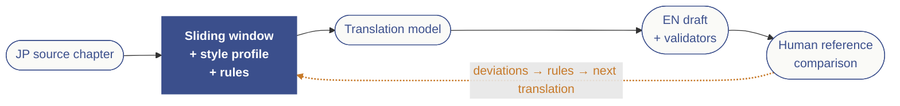

# ln-translator

JP-EN literary translation pipeline for the Japanese web novel
*仙台さんは余計なことばかり言う* ("Sendai-san Always Says Such Unnecessary Things"),
designed to match an established human translator's voice across 229 parallel parts.

## Approach

The pipeline is built on three ideas:

1. **A sliding window of recent translated chapters** provides rich
   in-context style examples to a strong base model — no fine-tuning
   required at the start. Each translation call sees the previous N
   parts as JP-EN pairs.
2. **A 16-dimension style profile** is extracted once from the EN
   reference corpus (tone, voice, sentence structure, narrative
   distance, pacing, figurative language, …) and injected into every
   translation, comparison, and judge prompt as a stable description
   of the target voice. The profile lives in
   `knowledge-vault/style/` as one Markdown file per dimension and
   can be hand-edited.
3. **A self-improving evaluation loop** compares the model's output to
   the existing human translation, extracts deviation patterns,
   clusters them into rules, and feeds those rules back into the
   prompt. Rules accumulate in an Obsidian-friendly Markdown vault
   that is the pipeline's knowledge store.

Fine-tuning is treated as a last-resort escalation, not a starting
point. See the v3 handoff document for the full design rationale.

### Architecture



Each new chapter flows through a single prompt that fuses the **sliding
window** of recently translated pairs, the **16-dimension style
profile**, the **glossary**, and the **active rules**. The model's
draft is validated and then compared against the human reference; the
deviations are clustered into candidate rules that, once promoted,
feed the next translation. The result is a closed loop that improves
in-place — Markdown rule vault, no fine-tuning.

### Models

Defaults use the latest frontier models as of May 2026:

| Role | Default | Notes |
|---|---|---|
| `translation` | `claude-opus-4-7` | 1M context fits the full sliding window; literary voice is Claude's strongest area. |
| `comparison` | `gpt-5.5` | Different family from `translation` to avoid self-graded blind spots. Reasoning effort `high`. |
| `clustering` | `gpt-5.5` | Operates on extracted notes; reasoning effort `medium`. |
| `judge` | `gpt-5.5` | Reasoning effort `high`. |
| `style_extraction` | `gpt-5.5` | One-shot characterization over the EN corpus; reasoning effort `high`. |

OpenAI calls go through the Responses API so `reasoning.effort` is
tunable per role (`REASONING_EFFORT_{COMPARISON,CLUSTERING,JUDGE,STYLE_EXTRACTION}`
in `.env`, allowed values `low`/`medium`/`high`/`xhigh`). Anthropic
Opus 4.7 rejects non-default `temperature`/`top_p`/`top_k`, so the
provider helper omits them automatically for that family.

### Scope

The pipeline only operates on numbered `part` entries with a
**miyagi** or **sendai** POV — i.e. the 229-part main story.
Maika POV side-stories (`EntryKind == "side_story_maika"`),
alternating-POV chapters (`POV == "both"`), interludes, extras, and
bonus content (`bookwalker`, `special`) are excluded everywhere by
default:

* `scrape jp` / `scrape en` skip them — re-running the scraper now
  fetches 229 entries, not 249.
* `scrape verify` reports them as "out-of-scope" and ignores them in
  the completeness counts.
* `prep calibrate` / `prep holdout` only see numbered parts, so
  validator thresholds and the holdout split aren't polluted by
  side-story style/length statistics.
* `build_window` filters them out of the sliding window — even
  consecutive numbering can't sneak a Maika side-story into the
  prompt context.
* `translate --part X` on a non-supported id exits with a clear error
  (`"X is a 'side_story_maika' entry; only numbered 'part' entries
  are translated by the v3 pipeline"`).

The single source of truth for "is this entry in scope?" is
`translator.scraper.models.is_translation_target`. To temporarily
include an excluded entry (e.g. spot-check an interlude scrape) pass
`--only` to the scrape commands.

## Sources

* **JP (original):** [Kakuyomu — 仙台さんは余計なことばかり言う](https://kakuyomu.jp/works/1177354054894027232)
* **EN (reference translation):** [Ave Lilium Translations](https://avelilium.com/story-about-buying-my-classmate-once-a-week/)

## Setup

This project uses [`uv`](https://docs.astral.sh/uv/) for dependency management.

```bash
uv sync --extra dev               # core + dev tools
uv sync --extra ml --extra dev    # add COMET / BERTScore (only needed for `evaluate score`)
cp .env.example .env              # then fill in API keys
```

## CLI

All operations are exposed through the `translator` command:

```bash
# Corpus
uv run translator scrape toc          # build data/metadata/toc.json
uv run translator scrape jp           # download Kakuyomu episodes
uv run translator scrape en           # download avelilium EN posts
uv run translator scrape verify       # check JP / EN pair coverage

# Prep
uv run translator prep pov            # POV breakdown of the corpus
uv run translator prep calibrate      # fit validator thresholds to the corpus
uv run translator prep holdout        # build stratified ~30-part test set

# Knowledge vault (deferred until you're ready)
uv run translator vault init          # create knowledge-vault/ tree + seed templates
uv run translator vault check         # offline pre-flight (glossary, templates, prompt assembly)
uv run translator vault status        # rule / deviation / round counts

# Glossary
uv run translator glossary show       # print active glossary

# Style profile (one-shot bootstrap; injected into every prompt)
uv run translator style extract --through part_050 --dry-run
uv run translator style extract --through part_050
uv run translator style show          # provenance + per-dimension sizes

# Translate (dry-run skips API calls; great for inspecting prompts)
uv run translator translate --part 4 --dry-run
uv run translator translate --part 4

# Validate a translation
uv run translator validate --part 4

# Self-evaluation loop
uv run translator evaluate deviations --round 1 --parts holdout
uv run translator evaluate cluster --rounds 1 --promote-round 1
uv run translator evaluate score --parts holdout
uv run translator evaluate judge --parts holdout
uv run translator evaluate report --round 1
```

## Layout

```
src/translator/
  scraper/      JP/EN site scrapers, ToC parser, pair verification
  prep/         POV lookup, stratified holdout, parallel corpus loaders
  vault/        knowledge-vault read/write helpers (rules, deviations, summaries)
  glossary/     vault-aware glossary loader (fallback to data/metadata/glossary_seed.json)
  style/        16-dimension style profile extractor + loader
  inference/    sliding-window builder, prompt assembler, provider abstraction
  validation/   dialogue parity, name frequency, length ratio checks
  eval/         COMET / BERTScore / deviation extractor / rule clusterer / LLM judge

data/
  metadata/     toc.json, holdout.json, glossary_seed.json (tracked in git)
  raw/          raw scraped HTML (gitignored)
  parallel/     part_NNN.{jp,en}.{txt,json} (gitignored)
  output/       per-part translation prompts and outputs (gitignored)

knowledge-vault/  (created by `translator vault init`; tracked in git)
  glossary/         curated term mappings
  style/            16 per-dimension profile files (01-tone.md … 16-character-voice.md)
  rules/{active,candidate,pruned,inactive}/
  deviations/round-NN/
  evaluations/round-NN-summary.md
  config/{prompt-template,comparison-prompt-template,clustering-prompt-template}.md

tests/                pytest suites
```

## Workflow

1. `translator scrape toc / jp / en / verify` — populate the corpus.
   The mapping is sequential: Kakuyomu episode `第N話` ↔ `part_N` for
   N in 1..417. Of those, 229 have an avelilium English translation
   (the rest are the JP-only tail past the human translator's progress).
   20 LN-exclusive entries (interludes, extras, side stories,
   bookwalker bonuses) are tracked in the ToC but excluded from the
   sliding window by `is_translation_target`.
2. `translator prep detect-pov` — for any `part_N` past the EN tail
   (no `(Miyagi PoV)` / `(Sendai PoV)` tag from avelilium), infer POV
   from the JP narrator by counting 仙台 / 宮城 mentions in narration
   only. Calibrated against the 229 EN-tagged parts: 229/229 agree.
3. `translator prep calibrate` — fit `length_ratio_*`,
   `dialogue_parity_max_skew`, and the `name_frequency_*_skew` bands to
   the observed corpus distribution. Re-run whenever the corpus changes
   materially and update `config.Thresholds` accordingly.
4. `translator prep holdout` — pick the test set; persisted to
   `data/metadata/holdout.json` and excluded from sliding-window context
   during evaluation.
5. `translator vault init` — create `knowledge-vault/` and seed the
   prompt template + glossary scaffold. Until vault rules are populated
   the prompt assembler still works (it falls back to the in-code
   template constants and the JSON glossary seed).
6. `translator style extract --through part_050` — one-shot bootstrap
   of the 16-dimension style profile from the EN corpus (minus
   holdout). Writes `knowledge-vault/style/01-tone.md` …
   `16-character-voice-differentiation.md`. The profile is injected
   into every translation, comparison, and judge prompt via the
   `$style_profile` placeholder; until extracted, prompts include a
   placeholder notice and translation continues normally.
7. **Round 1**: `translator translate --part X` for each holdout
   member, then `evaluate deviations --round 1 --parts holdout`,
   then `evaluate cluster --rounds 1 --promote-round 1`.
8. Promote / prune candidate rules in Obsidian (or by editing the
   note frontmatter). Re-translate the holdout to validate.
9. Iterate. Each round is one git commit on the vault so any
   translation can be reproduced by checkout.

## Calibration

`config.Thresholds` ships values calibrated against the 229 JP-EN
pairs of the (correctly-aligned) parallel corpus by
`translator prep calibrate`:

* `length_ratio_{min,max}` = corpus p05/p95 (2.05 / 2.67) ± a 10% safety
  margin → 1.85 / 2.94. Mean = 2.33, stdev = 0.19.
* `dialogue_parity_max_skew` = corpus p95 (0.107). The corpus mean is
  only 0.033 — JP and EN dialogue counts track very tightly — so this
  catches only the most-skewed 5% of chapters.
* `name_frequency_{warn,fail}_skew` = 0.65 / 0.90. JP elides subjects
  and EN has to fill them in, so per-character skew is structurally
  ~0.30 in the reference; this check primarily exists to catch
  catastrophic name-elision rather than normal expansion.

`window_size` is still set a priori (10) — run the ablation described
in the v3 handoff (5 / 10 / 15 / 20 across the holdout) and pick the
knee of the COMET curve. This is the one calibration step that costs
API spend.

## Open questions

These are tracked in the v3 handoff document and left here as living
notes:

* Optimal sliding-window size (run the ablation across 5 / 10 / 15 / 20).
* Best base model for translation (run the ablation across Claude
  Opus / Sonnet / GPT-4o).
* Rule cap before the prompt becomes diluted (~15-25 active rules is
  the rough estimate).
* Production error recovery policy: should a chapter that fails
  validation block the pipeline, get excluded from the next window,
  or get flagged for human review?

## Escalations

If the sliding-window + self-improving rule loop plateaus below
acceptable quality, two paths from the v3 handoff are still on the
table — but neither is scaffolded:

* **Hybrid window retrieval** (consecutive + similarity-retrieved
  reference parts via a ChromaDB index of all in-scope parts). Rebuild a
  `vectorstore/` module and reintroduce a retrieved-count knob in
  `Thresholds`.
* **Fine-tuning a base model** on the ~200 training parts with
  POV-conditioned system prompts. Rebuild a `fine_tune/` module and
  add a `MODEL_FINETUNE_BASE` override.

The v3 handoff doc has the full design rationale and trigger criteria
for each.
